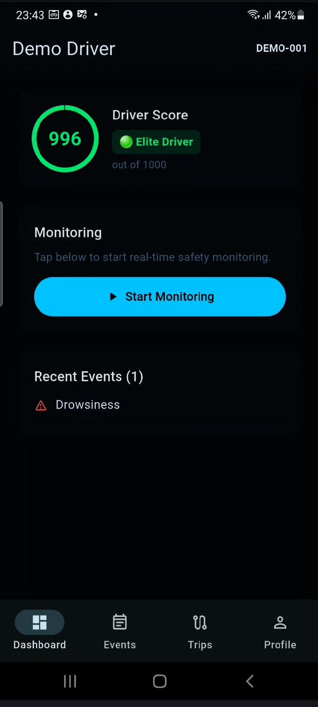
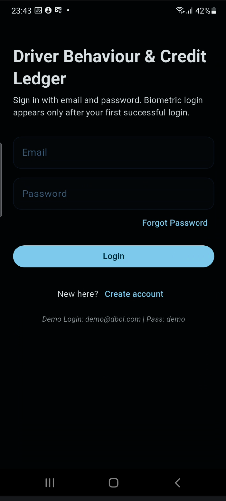
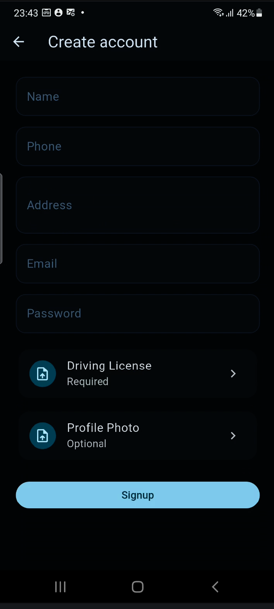
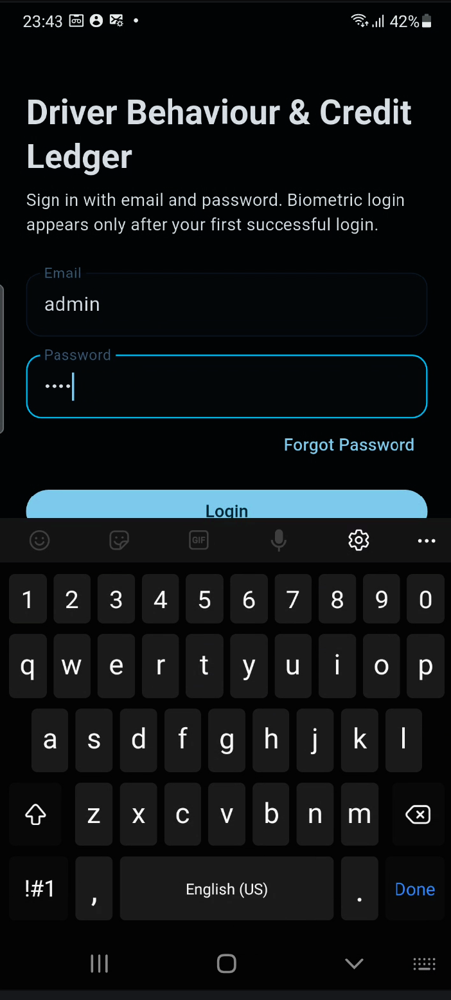

# 🚗 DBCL: Driver Behaviour & Credit Ledger

**DBCL** is a production-grade, real-time AI safety system built in **Flutter**. It monitors driver attentiveness locally on the device (Edge AI) and maintains a dynamic "Credit Score" (DBCL) based on behavioral patterns, rewarding safe driving and penalizing distractions.



## 🌟 Key Features

*   **Edge AI Vision**: Uses a highly optimized native Kotlin bridge to run Google's **MediaPipe Face Mesh** and **Hand Landmarker** at 30 FPS directly on the phone. Zero latency and no internet required for detection.
*   **Dual-Framerate Telemetry**: Runs AI locally at max frame rate, but intelligently throttles network telemetry to **1 FPS** to save mobile data and prevent backend server overload.
*   **Dynamic Scoring & Recovery**: 
    *   **Penalties**: Deducts points for Drowsiness (-3) and Phone/Distraction (-2) using strict consecutive-frame thresholds to prevent false positives.
    *   **Recovery Bonuses**: Awards +1 point for every 30 seconds of clean driving, and a bonus for ending a trip safely.
*   **Persistent Offline Storage**: Uses **Drift (SQLite)** to securely log events and trips locally. Automatically syncs with the FastAPI backend dashboard.
*   **Persistent UI Banner**: Displays an active camera monitoring banner to ensure safety compliance.

## 📱 App Screenshots

| Dashboard View | Live Monitoring | Trip Events History |
| :---: | :---: | :---: |
|  |  |  |

## 🛠️ Tech Stack
*   **Frontend**: Flutter (Dart), Riverpod (State Management)
*   **Edge AI (Native)**: Kotlin, Android MethodChannels, MediaPipe
*   **Database**: Drift (Local SQLite), FastAPI (Backend SQLite)
*   **Backend Server**: Python, FastAPI, Uvicorn

## 🚀 Architecture Overview
DBCL uses a Domain-Driven Design (DDD):
1.  **UI Layer**: Riverpod Providers handle the camera stream and scoring logic.
2.  **Native Bridge Layer**: Passes camera sensor orientation to Kotlin, rotates the frame natively, and returns precise EAR (Eye Aspect Ratio) and Hand-to-Face proximity metrics.
3.  **Data Layer**: Writes events to the local `LedgerRepository` while simultaneously dispatching a 1 FPS compressed JPEG stream to the FastAPI backend for remote fleet managers.

## 🏁 Setup & Run

### Prerequisites
- Flutter SDK (>= 3.11.5)
- Android Physical Device (Recommended for Camera/AI testing)
- Python 3.9+ (For Backend)

### 1. Start the Backend
```bash
cd backend
python -m venv .venv
source .venv/bin/activate
pip install -r requirements.txt
fastapi dev app/main.py
```

### 2. Run the Flutter App
```bash
git clone https://github.com/Arya-Akshat/DBCL-App.git
cd DBCL-App/flutter_driver_dbcl
flutter pub get
dart run build_runner build --delete-conflicting-outputs
flutter run
```

*Note: The AI models (`face_landmarker.task`, `facenet.tflite`) are securely embedded within the Android assets folder.*
